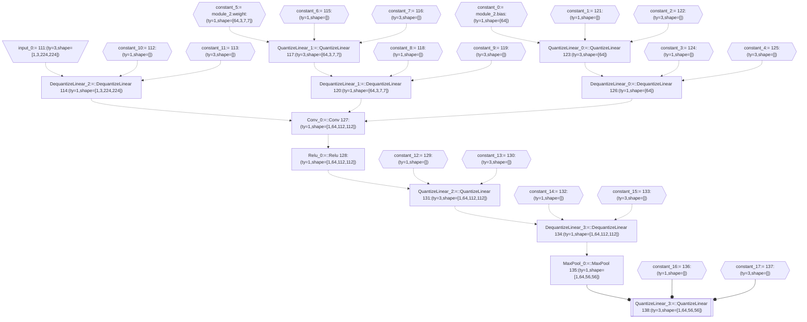
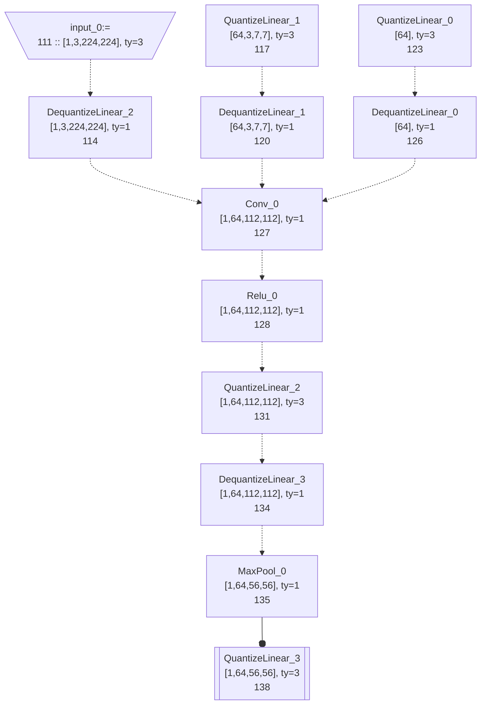

<!--
    Copyright (C) 2023 – 2024 Advanced Micro Devices, Inc. All rights reserved.
    Licensed under the MIT License.
 -->

# `onnxruntime_vitisiai_ep`

## Description

This is the finaly artifact of `VAIP` project.

# Internal tools for developers.

## `onnx_pattern_gen`

The `onnx_pattern_gen` tool is a utility for generating ONNX patterns. It takes an input ONNX model and generates a set of patterns that can be used for optimization or analysis purposes.

To use `onnx_pattern_gen`, you can follow these steps:

1. Install the required dependencies and build the tool.
2. Run the tool with the input ONNX model as the argument `-f`.
3. Specify input tensor names as the argument `-i`. If there are multiple inputs, we can use `-i` multiply times.
4. Specify a output tensor name as the argument `-o`. only a single output tensor name is supported.

`onnx_pattern_gen` generates C++ code to `test/onnx_grep_cxx_pattern.h.inc` which is used by `onnx_grep`

`onnx_pattern_gen` also generates a mermaid diagram to `test/onnx_grep_cxx_pattern.mmd`. Sometimes a pattern contains a constant pattern which is shared among many other nodes, it makes the diagram messy. When environment variable `IGNOER_CONSTANT` is set to `1`, then all constant pattern are hidden.

In generated c++ code, every pattern has a unique name based on their op type, for example, `Conv_0`, `Conv_1` etc. Names for contant patterns are like `constant_0`, `constant_1` etc. Names for input patterns, i.e. wildcard patterns, are like `input_0`, `input_1` etc.

For more detailed instructions and examples, please refer to the documentation or code comments in the `onnx_pattern_gen.cpp` file.

```
$BUILD/vaip/onnxruntime_vitisai_ep/onnx_pattern_gen -i 111 -o 138 -f ../test_onnx_runner/data/pt_resnet50.onnx
```

the sample generated c++

<div style="height: 200px; overflow: auto;">

```c++
// generated by : onnx_pattern_gen -i 111 -o 138 -f ../test_onnx_runner/data/pt_resnet50.onnx
auto builder = vaip_core::PatternBuilder();
auto constant_0 = builder.constant(); //  id = 0 module_2.bias
builder.bind("module_2.bias",constant_0);
auto constant_1 = builder.constant(); //  id = 1 121
builder.bind("121",constant_1);
auto constant_2 = builder.constant(); //  id = 2 122
builder.bind("122",constant_2);
auto QuantizeLinear_0 =  builder.node2("QuantizeLinear",{constant_0,constant_1,constant_2}); //  id=3 name= 123
builder.bind("123",QuantizeLinear_0);
auto constant_3 = builder.constant(); //  id = 4 124
builder.bind("124",constant_3);
auto constant_4 = builder.constant(); //  id = 5 125
builder.bind("125",constant_4);
auto DequantizeLinear_0 =  builder.node2("DequantizeLinear",{QuantizeLinear_0,constant_3,constant_4}); //  id=6 name= 126
builder.bind("126",DequantizeLinear_0);
auto constant_5 = builder.constant(); //  id = 7 module_2.weight
builder.bind("module_2.weight",constant_5);
auto constant_6 = builder.constant(); //  id = 8 115
builder.bind("115",constant_6);
auto constant_7 = builder.constant(); //  id = 9 116
builder.bind("116",constant_7);
auto QuantizeLinear_1 =  builder.node2("QuantizeLinear",{constant_5,constant_6,constant_7}); //  id=10 name= 117
builder.bind("117",QuantizeLinear_1);
auto constant_8 = builder.constant(); //  id = 11 118
builder.bind("118",constant_8);
auto constant_9 = builder.constant(); //  id = 12 119
builder.bind("119",constant_9);
auto DequantizeLinear_1 =  builder.node2("DequantizeLinear",{QuantizeLinear_1,constant_8,constant_9}); //  id=13 name= 120
builder.bind("120",DequantizeLinear_1);
auto input_0 = builder.wildcard(); //  id = 14 111
builder.bind("111",input_0);
auto constant_10 = builder.constant(); //  id = 15 112
builder.bind("112",constant_10);
auto constant_11 = builder.constant(); //  id = 16 113
builder.bind("113",constant_11);
auto DequantizeLinear_2 =  builder.node2("DequantizeLinear",{input_0,constant_10,constant_11}); //  id=17 name= 114
builder.bind("114",DequantizeLinear_2);
auto Conv_0 =  builder.node2("Conv",{DequantizeLinear_2,DequantizeLinear_1,DequantizeLinear_0}); //  id=18 name= 127
builder.bind("127",Conv_0);
auto Relu_0 =  builder.node2("Relu",{Conv_0}); //  id=19 name= 128
builder.bind("128",Relu_0);
auto constant_12 = builder.constant(); //  id = 20 129
builder.bind("129",constant_12);
auto constant_13 = builder.constant(); //  id = 21 130
builder.bind("130",constant_13);
auto QuantizeLinear_2 =  builder.node2("QuantizeLinear",{Relu_0,constant_12,constant_13}); //  id=22 name= 131
builder.bind("131",QuantizeLinear_2);
auto constant_14 = builder.constant(); //  id = 23 132
builder.bind("132",constant_14);
auto constant_15 = builder.constant(); //  id = 24 133
builder.bind("133",constant_15);
auto DequantizeLinear_3 =  builder.node2("DequantizeLinear",{QuantizeLinear_2,constant_14,constant_15}); //  id=25 name= 134
builder.bind("134",DequantizeLinear_3);
auto MaxPool_0 =  builder.node2("MaxPool",{DequantizeLinear_3}); //  id=26 name= 135
builder.bind("135",MaxPool_0);
auto constant_16 = builder.constant(); //  id = 27 136
builder.bind("136",constant_16);
auto constant_17 = builder.constant(); //  id = 28 137
builder.bind("137",constant_17);
auto QuantizeLinear_3 =  builder.node2("QuantizeLinear",{MaxPool_0,constant_16,constant_17}); //  id=29 name= 138
builder.bind("138",QuantizeLinear_3);
ret = QuantizeLinear_3; // return the root pattern
```

</div>

the generated mmd diagram.



if we enable environment varilabe `INGORE_CONSANT`, we can generate a compact diagram as below.

```
% env IGNORE_CONSTANT=1 $BUILD/vaip/onnxruntime_vitisai_ep/onnx_pattern_gen -i 111 -o 138 -f ../test_onnx_runner/data/pt_resnet50.onnx
```



Environment varible `NODE_FORMAT`, `CONSTANT_FORMAT` and
`INPUT_FORMAT` are used to configure the label in the mermaid diagram. The default vaule is as below.

```
$cxx_name<br>$shape, ty=$type<br>$node_arg_name
```

the meta variable in string are substituded.

 - `cxx_name` : the varible name for generated c++ code.
 - `node_arg_name`: the node arg name
 - `shape`: the shape of the node arg.
 - `type`: the type of the node arg.
 - `node_arg`: long string representation for a node.
 - `op_type`: op type of the ndoe.
 - `domain`: op domain of the node.
 - `pattern_id`: the pattern id.
